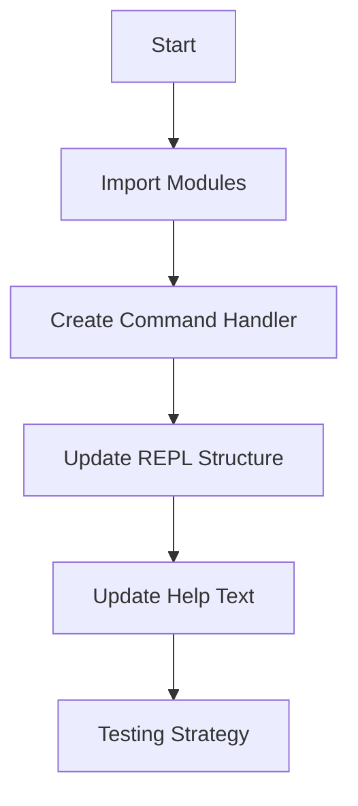

# Implementation Plan for `/plot` Command

## Workflow Overview



## Detailed Implementation Steps

### 1. Import Necessary Modules

```python
# In src/aopl_python_impl/aop_calculator_cli.py
import re  # Add this import
from aopl_python_impl import aop_visualizer  # Add this import
```

### 2. Create Command Handler Function

```python
def handle_plot_command(args_list: list[str], calculator: AoP_Calculator):
    """Parses plot command arguments and calls the visualizer."""
    try:
        s = " ".join(args_list)
        pattern = re.compile(
            r"^(?P<expr>.+?)\s+for\s+(?P<var>[a-zA-Z_]\w*)\s+from\s+(?P<start>.+?)\s+to\s+(?P<end>.+?)"
            r"(?:\s+steps\s+(?P<steps>\d+))?\s*(?P<logx>--logx)?\s*(?P<logy>--logy)?$"
        )
        match = pattern.match(s)

        if not match:
            print("Error: Invalid plot syntax.", file=sys.stderr)
            print("Usage: /plot <expression> for <var> from <start> to <end> [steps <num>] [--logx] [--logy]", file=sys.stderr)
            print(r"Example: /plot sin(x) for x from -#pi to #pi steps 50 --logy", file=sys.stderr)
            return

        parts = match.groupdict()
        expression_str = parts['expr'].strip()
        variable_name = parts['var'].strip()
        start_str = parts['start'].strip()
        end_str = parts['end'].strip()
        steps = int(parts['steps']) if parts['steps'] else 200
        log_x = bool(parts['logx'])
        log_y = bool(parts['logy'])

        print(f"Plotting y = {expression_str} for {variable_name} from {start_str} to {end_str}...")

        # Call the visualizer
        aop_visualizer.plot_expression(
            calculator=calculator,
            expression_str=expression_str,
            variable_name=variable_name,
            start_str=start_str,
            end_str=end_str,
            steps=steps,
            log_x=log_x,
            log_y=log_y
        )

    except ImportError:
        print("Error: Plotting requires 'matplotlib' and 'numpy'. Please install them:", file=sys.stderr)
        print("pip install matplotlib numpy", file=sys.stderr)
    except Exception as e:
        print(f"An error occurred during plotting: {e}", file=sys.stderr)
```

### 3. Update REPL Structure

```python
# In run_repl() function
elif command == "/plot":
    handle_plot_command(cmd_args, calculator)
```

### 4. Update Help Text

```python
# In /help command output
print("  /plot <expr> for...  - Plot a function. See '/plot' for full syntax.")
```

### 5. Testing Strategy

- **Unit Tests**:

  1. Test valid command syntax with various expressions
  2. Test edge cases (negative ranges, logarithmic scales)
  3. Test error handling (invalid syntax, missing dependencies)

- **Manual Tests**:
  - `/plot x^2 for x from -10 to 10`
  - `/plot sin(x) for x from -#pi to #pi steps 100 --logy`
