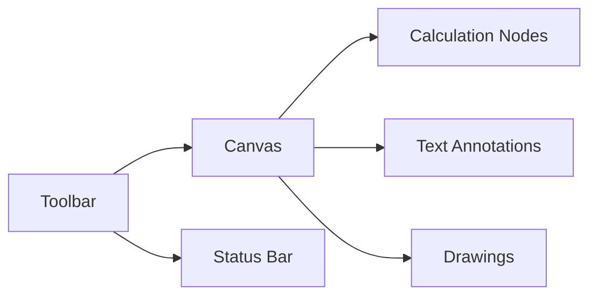

# Cosmic Scratchpad User Guide

The Cosmic Scratchpad is an interactive graphical environment for mathematical exploration using the Alphabet of Powers system. This guide covers all features and workflows.

## 1. Interface Overview

- **Toolbar**: Tools and actions
- **Canvas**: Infinite zoomable workspace
- **Status Bar**: Current base and coordinates

## 2. Core Features

### Calculation Nodes

- Click anywhere to create a node
- **Multi-line Input**:
  - `Shift+Enter` for new line
  - `Enter` to finalize and evaluate
- **Variable Assignment**: `$var = expression`
- **Real-time Updates**: Dependent nodes update automatically
- **Resizing**: Drag corners to resize, font auto-adjusts

### Drawing Tools

- **Line Tool**: Connect related nodes
- **Text Notes**: Add annotations (resizable with auto-font)
- **Pen Tool**: Freehand drawing for diagrams

### Base Management

- Interactive base changer
- All calculations update in real-time
- Preserves relationships during base changes

## 3. Slash Command Reference

| Command | Parameters | Description |
|---------|------------|-------------|
| `/help` | | Show available commands |
| `/vars` | | List all defined variables |
| `/constants` | | Show mathematical constants |
| `/letters` | | Display letter-exponent mapping |
| `/setbase` | `<base>` | Change numerical base |
| `/delvar` | `<$var>` | Delete a variable |
| `/explain` | `[expr|last]` | Explain expression or last result |
| `/explain model` | `<name>` | Set AI model (Ollama/OpenRouter) |

## 4. File Operations

- **New**: `Ctrl+N` - Start new scratchpad
- **Open**: `Ctrl+O` - Load `.cosmic` file
- **Save**: `Ctrl+S` - Save current session
- **Save As**: `Ctrl+Shift+S` - Save to new file

## 5. Workflow Examples

### Circle Properties Workflow

1. Create node: `$radius = 5a`
2. Create node: `$area = #pi * $radius^2`
3. Create node: `$circum = 2 * #pi * $radius`
4. Connect nodes with lines
5. Add text note: "Circle Properties"

### Base Exploration

1. Set base to 2 with `/setbase 2`
2. Create node: `a + b` → 2^1 + 2^2 = 6
3. Add node: `c * d` → 2^3 * 2^4 = 128
4. Switch back to base 10 to see different representations

### AI Explanations

1. Create node: `Z^2`
2. Run `/explain last`
3. View explanation: "Z equals base^100, so Z^2 = (base^100)^2 = base^200"

## 6. Tips and Tricks

- **Pan**: Hold space + drag
- **Zoom**: Mouse wheel or `Ctrl++`/`Ctrl--`
- **Multi-select**: `Shift+Click` nodes
- **Duplicate**: `Ctrl+D` selected items
- **Group**: `Ctrl+G` selected elements

 *Example complex workflow with dependencies*
