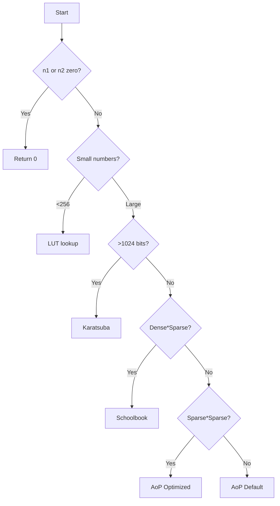

# hardware.py (CPU Simulation Module)

This module simulates CPU arithmetic operations and implements optimized multiplication algorithms with intelligent dispatching.

## Core Primitives

### Bitlist Conversions

- `number_to_bitlist(n: int) -> List[int]`: Converts integer to LSB-first bit list
- `bitlist_to_number(bits: List[int]) -> int`: Converts bit list back to integer

### Arithmetic Operations

- `_add_primitive(b1, b2)`: Bitwise addition with carry
- `_subtract_primitive(b1, b2)`: Bitwise subtraction (assumes b1 >= b2)
- `_shift_primitive(bits, amount)`: Logical left shift
- `_add_sparse_inplace_primitive(bits, exp)`: In-place addition of 2^exp

## CPU Class

### Initialization

```python
cpu = CPU()
```

- Precomputes lookup table for 8-bit multiplications
- Sets algorithm selection thresholds:
  - `KARATSUBA_THRESHOLD_BITS = 1024`
  - `DENSE_THRESHOLD_FACTOR = 0.9`
  - `SPARSE_POPCOUNT_THRESHOLD = 2`

### Intelligent Multiplication

`intelligent_multiply(n1: int, n2: int) -> int`
Selects optimal algorithm based on:

1. **Size**: Uses Karatsuba for >1024 bits
2. **Sparsity**:
   - Schoolbook for dense*sparse
   - AoP for sparse*sparse
3. **Default**: AoP-optimized for other cases



## Multiplication Algorithms

### 1. Schoolbook Method

`_multiply_schoolbook(n1, n2)`

- Traditional iterative approach
- Shifts and adds for each set bit
- Efficient for dense * sparse multiplications

### 2. AoP-Optimized

`_multiply_aop_optimized(n1, n2)`

- Uses sparse addition
- Only processes set bits
- Ideal for sparse * sparse multiplications

### 3. Karatsuba Algorithm

`_multiply_karatsuba(n1, n2)`

- Divide-and-conquer approach
- Recursively splits inputs
- Efficient for large numbers (>1024 bits)

### 4. Lookup Table (LUT)

`_multiply_lookup_table(n1, n2)`

- Uses precomputed 8-bit products
- Breaks numbers into chunks
- Shifts and accumulates partial products

## Complex Operations

### Exponentiation

`power_integer(base_n, exponent_n, multiply_func)`

- Uses exponentiation by squaring
- Requires multiplication function

```python
power_integer(3, 5, cpu.intelligent_multiply) → 243
```

### Multiply-Then-Add

`multiply_then_add(n1, n2, n3, multiply_func)`

- Computes (n1 * n2) + n3
- Uses primitive addition

```python
multiply_then_add(3, 5, 10, cpu.intelligent_multiply) → 25
```

## Example Usage

```python
from aopl_python_impl.cpu_sim.hardware import CPU

# Initialize and multiply
cpu = CPU()
result = cpu.intelligent_multiply(123456789, 987654321)

# Complex operations
power = power_integer(2, 100, cpu.intelligent_multiply)
sum_product = multiply_then_add(5, 10, 3, cpu.intelligent_multiply)
