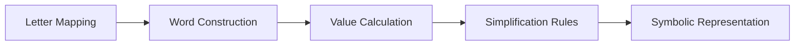
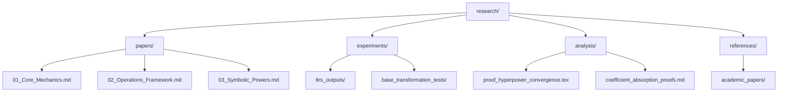

# Research Framework Plan for Alphabet of Powers

## 1. Research Plan Outline

### Core AoP Mechanics



### Operations Framework

| Operation | Theoretical Focus | Applied Focus |
|-----------|-------------------|--------------|
| + | Associativity proofs | Implementation edge cases |
| - | Inverse properties | Negative exponent handling |
| * | Distributive laws | Large number computations |
| / | Rational exponents | Division by zero handling |
| ^ | Hyper-power convergence | Tower of powers implementation |

### Advanced Topics

- **Symbolic Powers**: Representation of expressions like a<sup>b<sup>c</sup></sup>
- **Complex Numbers**: Handling imaginary exponents (e.g., i = √-1)
- **Base Transformations**: Generalizing to bases ≠ 10
- **Coefficient Absorption**: Rules for expressions like 2a → b (since 2×10¹ = 10²)

## 2. Folder Structure



## 3. Paper Template (`/research/papers/template.md`)

```markdown
# TITLE
## Abstract
[Brief summary of research contributions]

## 1. Introduction to AoP
- Background and fundamental principles
- Research objectives

## 2. Methodologies
### Theoretical Approach
[Mathematical framework]

### Experimental Setup
[ltrs commands used, parameters]

## 3. Results & Discussion
| Test Case | Expected | Observed | Variance |
|-----------|----------|----------|----------|
| a * b     | c        | c        | 0%       |

## 4. Conclusions
- Theoretical implications
- Practical applications
- Future research directions

## References
[Academic sources]
```

## 4. Implementation Roadmap

1. Create `/research` directory with subfolders
2. Populate each directory with starter files:
   - `/papers`: 3 blank Markdown templates
   - `/experiments`: README with ltrs command examples
   - `/analysis`: Proof template in LaTeX
   - `/references`: Curated bibliography
3. Add core research questions to each area
4. Establish version control for papers
