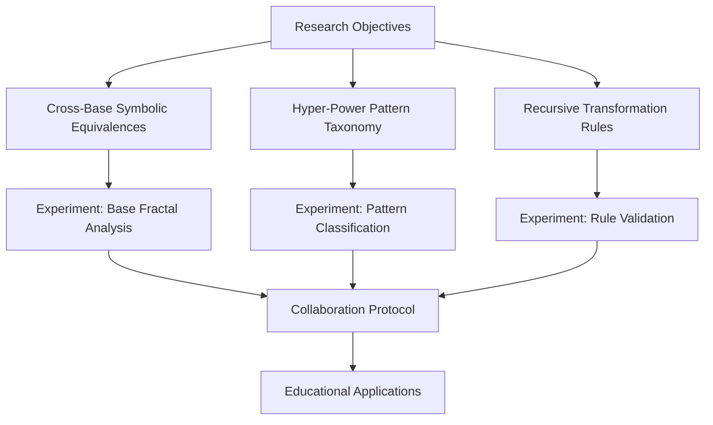
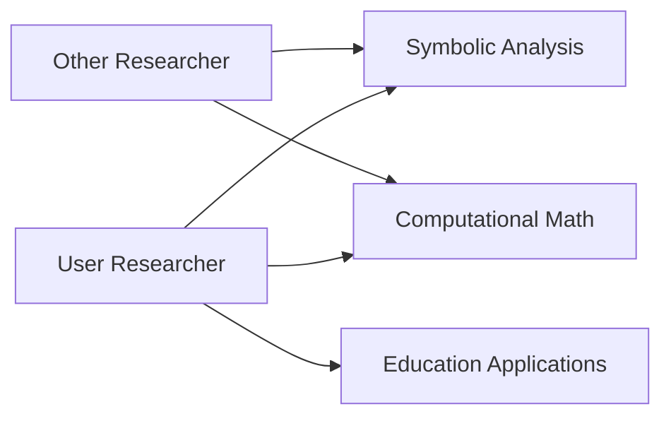

### Advanced Research Program: Symbolic Pattern Generalization



#### 1. Research Framework

**Cross-Base Symbolic Equivalences**

- Investigate fractal patterns across bases (2, 10, e)
- Develop equivalence mapping: `f(base1) ↔ f(base2)`
- Key metrics: Pattern similarity index, structural complexity

**Hyper-Power Pattern Taxonomy**

- Classification system:
  - Basic: Single-level exponents (aˣ)
  - Nested: Recursive towers (aˣʸᶻ)
  - Fractal: Self-similar notation (a^(a^(a^j)))
- Pattern characteristics:
  - Depth sensitivity
  - Base dependency
  - Coefficient absorption effects

**Recursive Transformation Rules**

- Formalize pattern generalization:
  - Base invariance: `P(base) ≡ P'(base')`
  - Depth compression: `a^(a^(a^x)) → a↑↑3(x)`
  - Fractal decomposition: `a^2YYYY → Σ component_letters`

#### 2. Experiment Templates

**Pattern Discovery Sessions**

```markdown
# FRACTAL PATTERN DISCOVERY TEMPLATE

## Objective
Identify self-similar notation patterns in hyper-power expressions

## Parameters
- Base: [2 | 10 | e]
- Depth: [3-6 nesting levels]
- Seed expression: [e.g., a^a^a, b^b^b]

## Procedure
1. Generate expression variants using AoP-CLI
2. Record symbolic outputs
3. Analyze pattern recurrence using:
   ```python
   def detect_fractal(expression):
       # Pattern matching algorithm
   ```

## Expected Output

- Fractal similarity score (0-1)
- Pattern visualization

```

**Automated Pattern Testing**
```python
# AUTOMATED TESTING SCRIPT
import subprocess

BASES = [2, 10, 2.71828]
DEPTHS = range(3, 7)
LETTERS = ['a', 'b', 'c', 'j']

for base in BASES:
    for depth in DEPTHS:
        for letter in LETTERS:
            expr = letter + '^' * (depth-1) + letter
            cmd = f'python -m src.aopl_python_impl.aop_calculator_cli "{expr}" --base {base}'
            result = subprocess.run(cmd, capture_output=True, text=True)
            analyze_pattern(result.stdout)
```

**Edge Case Exploration**

- Boundary conditions:
  - Base transition points (e.g., 1.0-1.1)
  - Depth-induced pattern collapse
  - Extreme coefficient absorption
- Failure mode documentation protocol

#### 3. Collaboration Protocol

**Team Structure**



**Workflow**

1. Daily sync (virtual): 08:00 GMT (15 min)
2. Shared research log: `research/collaboration_log.md`
3. Division of responsibilities:
   - User: Pattern taxonomy + Education apps
   - Other: Base equivalences + Edge cases
4. Merge protocol: Weekly reconciliation of findings

#### 4. 48-Hour Timeline

```mermaid
gantt
    title 48-Hour Research Sprint
    dateFormat  HH:mm
    section Phase 1
    Framework Design       :a1, 00:00, 12:00
    Experiment Templates   :a2, 12:00, 24:00
    section Phase 2
    Initial Experiments    :b1, 24:00, 36:00
    Collaboration Setup    :b2, 36:00, 42:00
    section Phase 3
    Validation             :c1, 42:00, 48:00
```

#### 5. Implementation Strategy

1. Create framework documents in `/research/framework_v2`
2. Generate experiment templates as Markdown files
3. Establish collaboration log
4. Develop automated testing scripts
5. Schedule validation sessions
