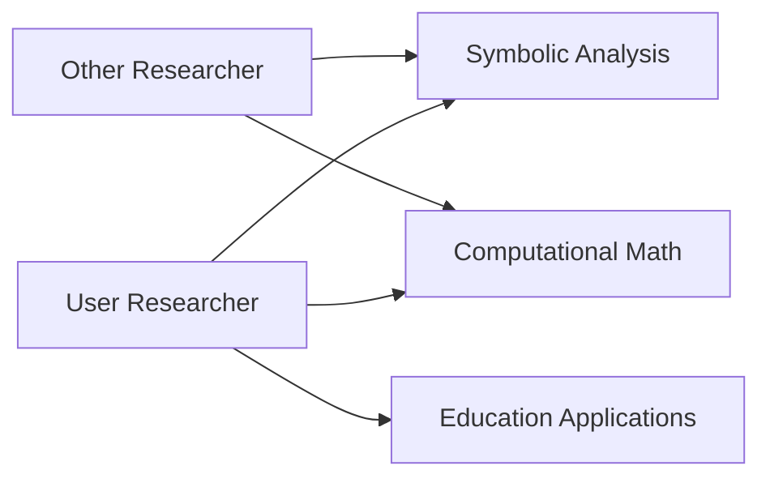

# Research Collaboration Log

## Team Structure

## Responsibilities

### User Researcher

1. Hyper-Power Pattern Taxonomy
2. Educational Applications
3. Pattern Discovery Sessions

### Other Researcher

1. Cross-Base Symbolic Equivalences
2. Computational Mathematics
3. Edge Case Exploration

## Workflow Protocol

1. **Daily Sync**: 08:00 GMT (15 min virtual meeting)
2. **Log Updates**: All findings recorded here by EOD
3. **Merge Process**: Weekly reconciliation every Friday 17:00 GMT

## Task Tracking

| Date | User Tasks | Other Researcher Tasks | Status |
|------|------------|------------------------|--------|
| 2025-06-20 | Framework setup | Base equivalence experiments | In progress |
| 2025-06-21 | Taxonomy development | Edge case identification | Planned |
| 2025-06-22 | Educational applications | Computational validation | Planned |

## Conflict Resolution

1. Document disagreements in "Issues" section below
2. Escalate unresolved issues after 24hrs to project lead
3. Final arbitration by project lead if needed

## Issues

- None currently
