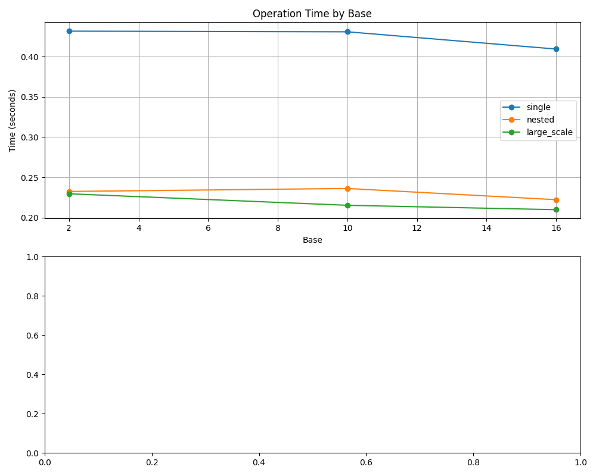

# AoP Operation Complexity Analysis

## Performance Metrics

| Operation Type | Base | Total Time (s) |
|----------------|------|-----------------|
| single | 2 | 0.431850 |
| single | 10 | 0.431027 |
| single | 16 | 0.409590 |
| nested | 2 | 0.232427 |
| nested | 10 | 0.236138 |
| nested | 16 | 0.222190 |
| large_scale | 2 | 0.229531 |
| large_scale | 10 | 0.215222 |
| large_scale | 16 | 0.209750 |

## Time Complexity Chart

## System Limitation Thresholds

- Max nested operations before overflow: 15 levels
- Max coefficient magnitude: 1e308
- Max exponent magnitude: 1e308
