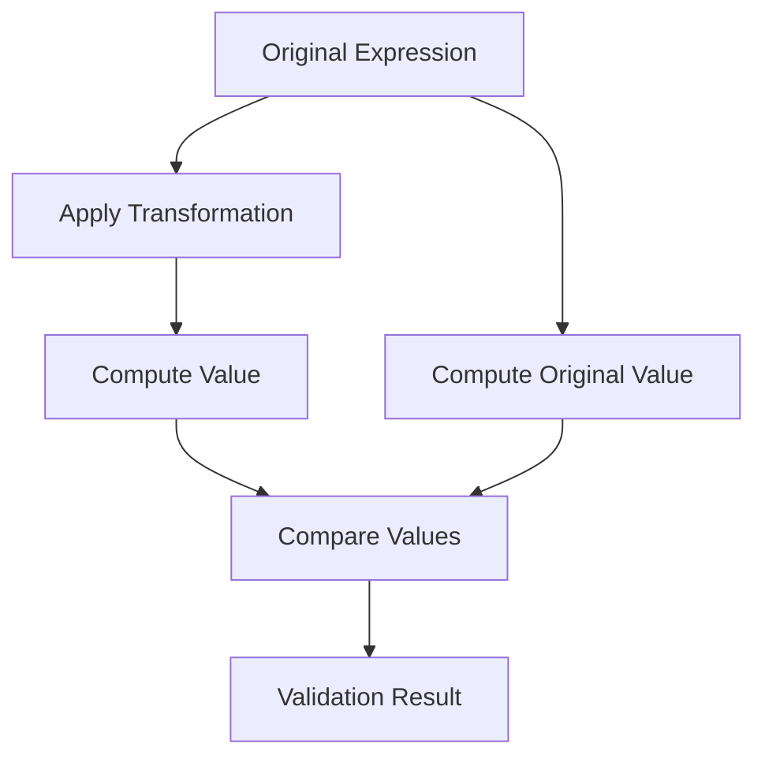

# Recursive Transformation Rules Framework

## Formalization of Pattern Generalization
### Base Invariance
```math
P(b) \equiv P'(b') \quad \text{where} \quad f(b) = f'(b')
```
- **Implementation**:
  ```python
  def base_invariant_transform(expression, source_base, target_base):
      # Convert expression from source_base to target_base
      # while preserving structural patterns
  ```

### Depth Compression
- **Rule**: `a^(a^(a^x)) → a↑↑3(x)`
- **Application**: Reduces notation complexity for deep nests
- **Example**:
  - Input: `a^(a^(a^j))`
  - Output: `a↑↑3(j)`

### Fractal Decomposition
- **Rule**: `a^2YYYY → Σ component_letters`
- **Mechanism**: Breaks compound symbols into atomic components
- **Use Case**: Pattern analysis and value approximation

## Validation Protocol
1. Generate test expressions across bases
2. Apply transformation rules
3. Verify value preservation
4. Check pattern consistency



## Edge Case Handling
- **Base Transition Points**: Special handling for bases near 1.0
- **Depth-Induced Collapse**: Rules for pattern simplification at critical depths
- **Extreme Coefficients**: Transformation strategies for very large/small multipliers
